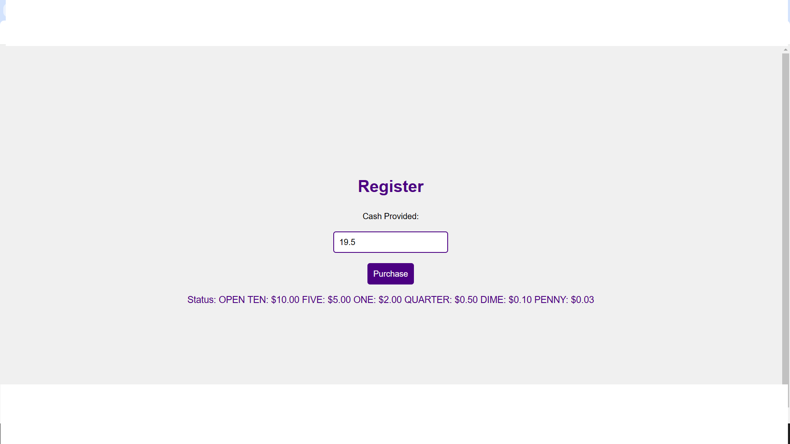

# Cash Register

## Overview

The Cash Register application calculates the change due to a customer based on the price of the item, the amount of cash provided by the customer, and the amount of cash in the cash drawer. It displays different messages to the user in various scenarios, such as when the customer provides too little cash or when the cash drawer doesn't have enough to issue the correct change.

## Features

- 💵 Input field for the amount of cash provided by the customer.
- 🛒 Button to initiate the purchase.
- 📜 Display of the change due or relevant status messages.
- 🔄 Handles different scenarios:
  - 🚫 Insufficient funds
  - ✔️ Exact cash provided
  - 💰 Change due with available cash in the drawer
